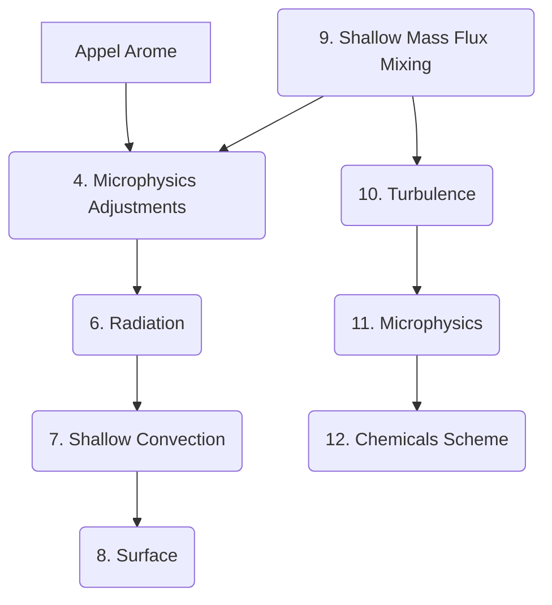

# Microphysique Arome - FVM

Dans ce document, nous décrivons la microphysique paramétrée pour Arome, et son adaptation au noyau dynamique de FVM.

2 options
- ICE3 : schéma de microphysique à 1 moment.
- LIMA : schéma de microphysique à 2 moments.

### Séquence des Paramétrisations physiques d'Arome

La microphysique est appelée dans l'étape d'ajustement (4. Microphysical Adjustments) et le calcul des sources et de la sédimentation (11. Microphysics).

<!--  -->

_(Les numéros manquants concernent des opérations de conversion)_

### ICE 3

ICE 3 utilise un schéma de microphysique à 6 espèces (vapeur, goutelettes, glace en suspension, eau de pluie, neige, graupel). La paramétrisation suit le schéma de Kessler pour les processus chauds, et une paramétrisation à 3 classes pour la glace.

Il s'agit d'un schéma à un moment pour lequel les quantités suivies sont les contenus spécifiques des 6 espèces.

Variables pronostiques :

1. $q_{v}$ : contenu spécifique en vapeur d'eau ($kg.kg^{-1}$)

Espèces précipitantes :

1. $q_{r}$ : - en pluie ($kg.kg^{-1}$)
1. $q_{s}$ : - en neige ($kg.kg^{-1}$)
1. $q_{g}$ : - en grésil (graupel) ($kg.kg^{-1}$)

Espèces non précipitantes :

1. $q_{i}$ : - en cristaux de glace ($kg.kg^{-1}$)
2. $q_{c}$ : - en goutelettes (cloud droplets) ($kg.kg^{-1}$)

#### Equation pronostique d'évolution

L'évolution des contenus spécifiques est régi par une équation d'advection qui prend en compte le processus de sédimentation pour les espèces précipitantes.

Les variables du modèles sont **x**, t et D (le diamètre des hydrométéores) et le système d'équations est fermé par une relation diagnostique sur la répartition des espèces, en fonction du diamètre des hydrodmétéores.

$$ \frac{\partial \rho r_x}{\partial t} + \frac{\partial \rho r_x(\omega - V^t_x)}{\partial z} = S_{micro} $$

avec $V_x = 0$ pour les espèces non précipitantes (pas de sédimentation), et $V_x = 5 m.s^{-1}$ pour la pluie, $V_x = 0.3 m.s^{-1}$ pour la neige.

$S_{micro}$ représente les sources microphysiques pour respectives pour chaque espèce.
Plus de 25 processus sont modélisés dans ICE3. Chaque processus est traité séquentiellement, et l'ordre de traitement des processus a son importance. Le détail des sources est décrit dans le paragraphe [processus microphysiques](#processus-microphysiques---ice3).

#### Remarque

Pour Arome, $\rho$ est la masse volumique totale sur la maille et les contenus spécifiques sont définis par rapport à la masse totale de la maille.

Pour Méso-NH et la microphysique, les contenus spécifiques sont définis par rapport à une masse volumique de référence telle que $\rho_{dref} r_x = \rho_{d} r_x^{'}$

Dans le cas de FVM, $\rho = \rho_d$ est la masse volumique d'air sec de la maille et les contenus spécifiques sont définis par rapport à la masse d'air sec.

#### Fermeture
La répartition des espèces d'eau est paramétrée par une loi Gamma généralisée, simplifiée par une loi de Marshall-Palmer :

$$ n(D) = N_0 \lambda e^{-\lambda D} $$
La masse et le vitesse finale de chute sont liées par une loi en puissance.

$$m(D) = aD^b$$

$$v(D) = (\frac{\rho_0}{\rho_{dref}})^{0.4}cD^d$$

${a, b, c, d}$ sont donnés pour chacune des espèces dans la documentation de Méso-NH.

Ces relations diagnostiques réalisent une fermeture de l'équation d'advection par la vitesse moyenne de chute pondérée par la masse (Lopez 2002).

$$ V_x^t = \frac{\int_0^\infty v(D)m(D)n(D)\mathrm{d}D}{\int_0^\infty m(D)n(D)\mathrm{d}D}$$

Le pas de temps utilisé pour la sédimentation est $\delta t$ = 3s.

Arome utilise [un schéma de sédimentation statistique](#sédimentation---arome) pour laquelle les composantes du flux de sédimentations sont paramétrés par une loi exponentielle. Le schéma est adapté aux long pas de temps et élimine les contraintes dues aux CFL de sédimentation.

Pour FVM, nous utilisons le schéma d'advection de la dynamique pour résoudre la sédimentation de manière Eulérienne (MPDATA) ou semi-lagrangienne (FFSL). L'adaptation du noyau dynamique de FVM pour la sédimentation est donné [ci-dessous](#advection---sédimentation-pour-fvm).

#### Ajustements microphysiques

Ajustement : les fractions massiques de goutelettes (_cloud droplets_) et de glace (_pristine ice_) issues de la sursaturation en vapeur sont calculées.

Ces fractions massiques permettent de diagnostiquer la couverture nuageuse.

L'étape d'ajustement force l'équilibre thermodynamique entre les espèces microphysiques et le champ de température, après élimination de la sursaturation en vapeur d'eau.

L'étape d'ajustement utilise :
- la sortie du modèle de convection (shallow convection) &rarr; subgrid cloud droplets mixing ratio and subgrid cloud ratio,
- la sortie du modèle de turbulence &rarr; variance d'écart à la saturation.

#### Condensation

1. Calcul des chaleurs latentes de vaporisation / sublimation :
    $$ l_v = l_v(TT) + (C_v - C_l) * (T - TT)$$
    $$ l_s = l_s(TT) + (C_v - C_i) * (T - TT)$$
   où $TT$ est la température au point triple.

2. Calcul de la capacité calorifique de la maille :
    $$ C_p = C_{pd} + C_{pv} * r_v + C_l * (r_c + r_r) + C_i * (r_i + r_g + r_s)  $$

3. Pressions de vapeur saturante (sur l'eau liquide et sur la glace ):

    $$ P_{sat(w)} = \mathrm{e}^{\alpha_w - \beta_w / T - \gamma_w  log(T)}$$
    $$ P_{sat(i)} = \mathrm{e}^{\alpha_i - \beta_i / T - \gamma_i  log(T)}$$

4. Fraction de glace
    $$ f = \frac{r_i}{r_c + r_i}$$

5. Transformation isobare
    $$ q_{sat(l)} = \frac{R_d}{R_v} \frac{P - P_{sat(w)}}{P_{sat(w)}} $$
    $$ q_{sat(i)} = \frac{R_d}{R_v} \frac{P - P_{sat(i)}}{P_{sat(i)}} $$

6. Interpolation entre liquide et solide pour une condensation multiphasique.
    $$ q_{sat} = (1 - f) q_{sat(l)} + f q_{sat(i)} $$
    $$ l_{vs} = (1 - f) l_v + f l_s$$

#### Ajustement de la température

La température est ajustée en fin de l'étape d'ajustement, une fois que les fractions de vapeur d'eau, d'eau liquide et de glace ont été réajustées.

$$ T = T^* - \frac{L_v(T^*) r_c + L_s(T^*)r_i}{C_{ph}}$$

Où $T^*$ est la température avant ajustement et $T$ après.

Implémentation : la température est ajustée en une itération par méthode de Newton généralisée (à l'ordre 2). L'ajustement est réalisé en une itération suivant la procédure de Langlois (1973).

#### Rain Ice

Les précipitation de surfaces sont calculées par sédimentation, et les termes sources issus des transformations microphysiques sont diagnostiqués.

Etapes :
- Estimation des flux de sédimentation,
- Calcul de la nucléation (formation d'espèces précipitantes),
- Calcul des sources microphysiques.

### Sédimentation - AROME

L'équation de conservation du contenu en eau de pluie s'écrit :

$$\frac{Dq_r}{Dt} = \frac{1}{\rho}\frac{\partial}{\partial z}F_r + s_r^o - s_r^i$$

Schéma de sédimentation basé sur une densité de probabilité : adaptée aux longs pas de temps. Le flux sortant d'une cellule est composé :
- des espèces précipitantes contenues dans la cellule à t et sorties à t + dt,
- des espèces précipitantes traversant la cellule entre t et t + dt (CFL de sédimenation supérieures à 1).

$$ F_r(j) = P_1 * \rho \frac{\delta z}{\delta t} q + P_2 * F_r(j-1) $$

où q est issu des sources microphysiques.

- Paramétrisation statistique :
    On note $Z = \frac{z}{\omega t}$ avec $\omega_s$ vitesse moyenne de sédimentation.

    $Z$ suit une loi exponentielle, qui caractérise la durée de vie d'une particule de pluie au cours de la sédimentation. $Z$ est le rapport entre la distance parcourue $d = \omega \delta t$ et la taille caractéristique d'une maille $\delta z$.

    Densité de probabilité associée à $Z$ : $P_0(z) = \mathrm{e}^{-z}$

    Le flux sortant est alors décrit comme :
    - la fraction massique qui sort de la maille entre $t$ et $t + \delta t$ :
        $$P_1 = \int_0^{\delta z} P_0(z, \delta t) dz $$

    - la composante du flux entrant qui traverse la maille entre $t$ et $t + \delta t$ :
        $$P_2 = \int_0^{\delta t} P_0(\delta z, t)dt $$

Le contenu en eau de pluie est mis à jour :

$$ q_r^+ = q_r^- + \frac{\delta t}{\rho \delta z}(F_r(j-1) - F_r(j)) + s_r^o - s_r^i $$

### Sédimentation - Méso-NH

Méso NH donne la possibilité de calculer la sédimentation par time-splitting. Les taux de sédimentations suivent une équation diagostique (qui dépend de la paramétrisation de Marshall-Palmer).

On a alors

$$ q_r^+ = q_r^- + \delta t R_{sed} + s_r^o - s_r^i$$

où

$$R_{sed} = \frac{1}{\rho}\frac{\partial}{\partial z}\int_0^\infty N(D)V(D) \frac{\pi}{6} \rho_{lw} D³V(D)N(D)\mathrm{d}D  $$

Un schéma "upwind" explicite est utilisé pour la sédimentation avec un pas de temps déterminé à partir de la stabilité (CFL) du schéma pour une vitesse de 7 m/s.

### Advection - Sédimentation pour FVM

L'exemple de la fraction massique de pluie est pris.

1. Equation pronostique d'advection-sédimentation :
$$ \frac{\partial \rho r_c}{\partial t} + \frac{\partial \rho r_c(\omega - V^t_r)}{\partial z} = S_{micro} $$
où $V^t_r$ est la vitesse moyenne de chute pondérée par la masse.

La vitesse de sédimentation diagnostique est donnée par la vitesse de chute moyenne pondérée par la masse (Lopez 2002) :

$$V^t_r = C_{sed}(\frac{\rho_0}{\rho_{dref}})^{0.4} (\rho r_c)^{1/6}$$

Cet équation diagnostique pour la vitesse est cohérente celle de Liu et Orville (1969) utilisée par Geleyn (2007) pour son approche statistique de la sédimentation.

For notational commodity, we define
$$ w_r = \omega - V^t_r$$

_Option 1_ La relation d'advection-sédimentation devient :

$$\frac{\partial \rho r_c}{\partial t} + \frac{\partial \rho r_c w_r }{\partial z} = S_{micro} $$

<!-- $$ \frac{\partial \rho r_c}{\partial t} + \frac{\partial \rho r_c\omega}{\partial z} - C_{sed}  (\frac{\rho_0}{\rho})^{0.4}\frac{7}{6} (\rho r_c)^{1/6} \frac{\partial \rho r_c}{\partial z}= S_{micro} + C_{sed} (\rho r_c)^{7/6} \frac{\partial}{\partial z}(\frac{\rho_0}{\rho})^{0.4}$$ -->

_Option 2_ Par simplification, on peut choisir une vitesse de sédimentation constante $V^t_r = V_{sed}$.(Lopez 2002) Lopez choisit des vitesses de sédimentation constantes, respectivement égales à $5.0 m.s^{-1}$ pour la pluie et $0.9 m.s^{-1}$ pour la neige et montre que l'utilisation d'une équation pronostique pour la vitesse finale de chute n'est pas nécessaire.

2. Schéma d'advection - Intégration dans FVM

La sédimentation est traitée par l'advection avec MPDATA, ce qui permet d'éliminer le calcul des flux de sédimentation dans la physique.

En utilisant l'option non oscillatoire de MPDATA, l'advection-sédimentation garantit la positivité des contenus spécifiques et des fractions de nuages.

#### Processus microphysiques - ICE3

1. Slow cold processes (ice4_slow)
    1. NUCLEATION
    1. RRHONG : spontaneous freezing sources
    1. RIMLTC : cloud ice metling
    1. RSRIMCG
    1. RCHONI : homogeneous nucleation source
    1. RVDEPS : deposition on $r_s$
    1. RIAGGS : aggregation on $r_s$
    1. RIAUTS : autoconversion $r_i$ &rarr; $r_s$
    1. RVFEPG : deposition on graupel
1. Slow warm processes (ice4_warm)
    1. RCAUTR : autoconversion of $r_c$ for $r_r$
    1. RCACCR : accretion of $r_c$ for $r_r$
    1. RREVAV : evaporation of $r_r$

1. Fast cold processes for snow (fast_rs)
    1. cloud roplet riming of aggregates
    1. rain accretion onto aggregates
    1. conversion melting of aggregates
1. Fast cold processes for graupel (fast_rg)
    1. rain contact freezing
    1. graupel growth
    1. accretion of rain drops on graupel
    1. melting of graupel
1. Fast Ri : Rergeron-Findeisen effect
    1. RCBERI

### Interactions Microphysique - Turbulence et Convection

#### Shallow convection

2 quantités sont diagnostiquées à partir du schéma de convection peu profonde.
- $ C_f $ : cloud fraction proportionnelle à la surface de convective updraft.
- $ r_{c - mf}, r_{i - mf}$ : flux de contenu en "cloud droplets" et en "pristine ice".

Les 2 quantités sont proportionnelles à la surface de convective updraft (diagnostiquée à partir d'une équation sur le vent vertical).

#### Condensation de sous-maille Méso-NH / AROME

La condensation de sous maille est fermée avec les hypothèses de Bougeault (1982).

Bougeault définit les variables conservatives

Extension à un schéma multiphase : une pondération par la fraction massique de glace est utilisée.

#### Interaction avec la turbulence

Schéma statistique de condensation de sous-maille : la variance de l'écart à la saturation est diagnostiquée par le schéma de turbulence.

Exemple : si le contenu spécifique moyen en vapeur d'eau $q_{v}$ est nul sur la maille mais que la variance est non nulle, le contenu spécifique en gouttelettes $q_{c}$ peut être non nul.

<!-- ### LIMA (moments d'ordre 2)

Utilisé en mode recherche pour l'investigation des interactions nuages - aérosols. -->

### Couplage Physique - Dynamique

Les espèces sont advectées par le schéma Semi-Lagrangien. Elles agissent sur les termes d'inertie et de gravité (équation du mouvement), et sur les termes d'inertie thermique (équation thermo).

### Cloud Scheme - ECMWF

Tiedtke cloud scheme (1993) utilisé pour la microphysique. 2 variables pronostiques : couverture nuageuse horizontale de la maille + mass mixing ratio pour les condensats.

4 variables pronostiques :
1. Eau liquide (nuages)
2. Glace (nuages)
3. Pluie (précipitations)
4. Neige (précipitations)

5. Couverture nuageuse (cloud fraction)

Contrairement à ICE3, le schéma de sédimentation est analytique &rarr; forward in time - upstream. La vitesse de chute est constante pour éviter les "chocs" numériques.

### Bases théoriques - Bulk Microphysics Parametrizations

- Distributions de tailles hydrométéores : loi gamma
- Relations taille - propriétés : lois en puissance

#### Contruction

La disrtibution la plus probable est obtenue en maximisant l'entropy de Shannon

$$ H = -k \int \rho(z)ln(\rho(z))dz$$
avec $$ \rho(z) = n(z) / N $$ la probabilité d'occurence d'une particule.

### Références

1. Termonia, P., Fischer, C., Bazile, E., Bouyssel, F., Brožková, R., Bénard, P., Bochenek, B., Degrauwe, D., Derková, M., El Khatib, R., Hamdi, R., Mašek, J., Pottier, P., Pristov, N., Seity, Y., Smolíková, P., Španiel, O., Tudor, M., Wang, Y., Wittmann, C., and Joly, A.: The ALADIN System and its canonical model configurations AROME CY41T1 and ALARO CY40T1, Geosci. Model Dev., 11, 257–281, https://doi.org/10.5194/gmd-11-257-2018, 2018.

2. Seity, Y., Brousseau, P., Malardel, S., Hello, G., Bénard, P., Bouttier,
F., Lac, C., and Masson, V.: The AROME-France Convective-
Scale Operational Model, Mon. Weather Rev., 139, 976–991,
https://doi.org/10.1175/2010MWR3425.1, 2011.

3. Lascaux, F., E. Richard, and J.-P. Pinty, 2006: Numerical simula-
tions of three map IOPs and the associated microphysical
processes. Quart. J. Roy. Meteor. Soc., 132, 1907–1926.

4. Lopez, P. 2002. Implementation and validation of a new prognostic large-
scale cloud and precipitation scheme for climate and data-assimilation
purposes. Q. J. R. Meteorol. Soc. 128, 229–257.

5. Langlois, W. E., 1973: A rapidly convergent procedure for computing large-scale condensation in
a dynamical weather model. Tellus, 25 (1), 86–87, doi:10.1111/j.2153-3490.1973.tb01598.x.
6. Geleyn J.-F., Catry B, Bouteloup Y., Brozkova R. 2008. A statistical approach for sedimentation inside a microphysical precipitation scheme. Tellus.
7. Bouteloup Y. Seity Y., Bazile E. 2010. Description fo the sedimentation scheme used operationnally in all Météo-France NWP Models. Tellus.
8. Morrison H. 2011. On the Numerical Treatment of Hydrometeor Sedimentation in Buld and Hybrid Buld-Bin Microphysics Schemes. Monthly Weather Review.
9. Bougeault P. 1982. Cloud-Ensembles Relations Based on the Gamma Probability Distribution for the Higher-Order Models of the Planetary Boundary Layer. Monthly Weather Review.
